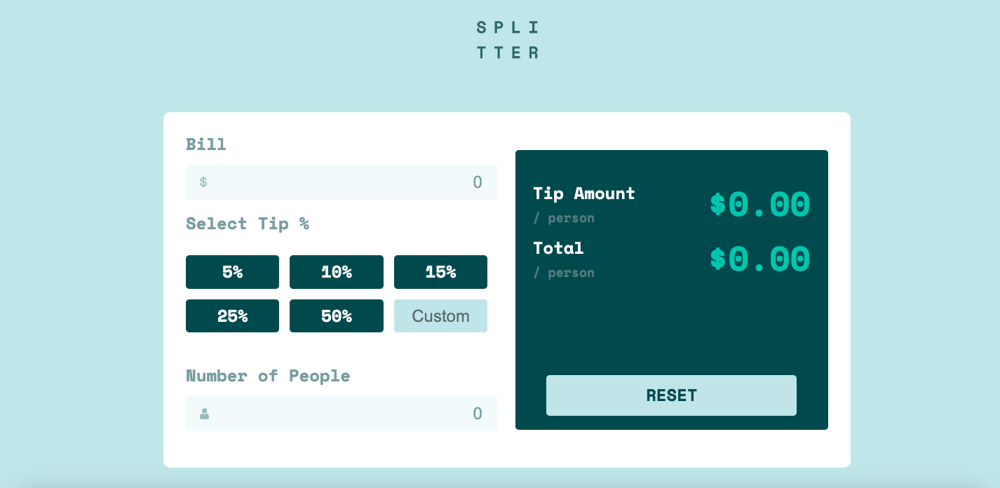
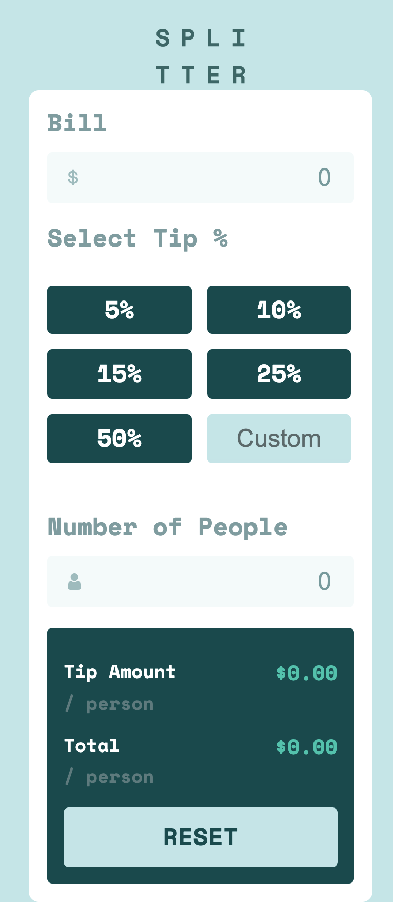

# Frontend Mentor - Tip calculator app solution

This is a solution to the [Tip calculator app challenge on Frontend Mentor](https://www.frontendmentor.io/challenges/tip-calculator-app-ugJNGbJUX). Frontend Mentor challenges help you improve your coding skills by building realistic projects.

## Table of contents

- [Overview](#overview)
  - [The challenge](#the-challenge)
  - [Screenshot](#screenshot)
  - [Links](#links)
- [My process](#my-process)
  - [Built with](#built-with)
- [Author](#author)

### Installation

>`npm i`

### Runing the app

>`npm run start`

### Linters

- Check the lintings
>`npm run lint`

- Fix lintings

>`npm run lint:fix`

### Tests

Test are written using jest

- To run all test cases

>`npm run test`

### The challenge

Users should be able to:

- View the optimal layout for the app depending on their device's screen size
- See hover states for all interactive elements on the page
- Calculate the correct tip and total cost of the bill per person

### Screenshot

- Desktop version

- Mobile version

### Links

- Live Site URL: [Check here](https://tip-calculator-app-react.surge.sh)

## My process

First of all I've create the application using CRA cli, then I've created the base structure of the application including style-guide which was the base to create shared components and document them with JSDoc.
Then I've implement the structure of application added logic and finaly added some responsivness to application

### Built with

- HTML5
- CSS
- Sass
- Flexbox
- [React](https://reactjs.org/) - JS library
- Typescript
- JSDoc
- Jest

## Author

- Albert Hovhannisian
- Email: albert.hovhannisian.main@gmail.com
- TG: @albert_hov
